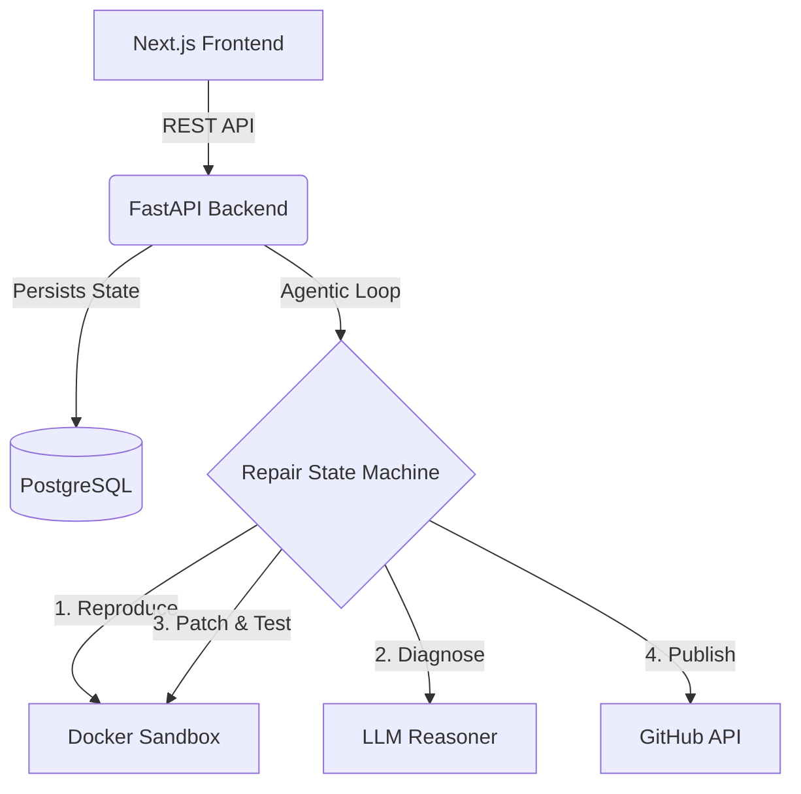

<div align="center">
  
# 🤖 FIXYRON

**Autonomous Software QA & Bug-Fixing Agent**

[](https://nextjs.org/)
[](https://fastapi.tiangolo.com/)
[](https://www.postgresql.org/)
[](https://www.docker.com/)

*Your automated AI software engineer. Fixyron ingests repositories, reproduces bugs, diagnoses root causes, safely tests patches in isolated sandboxes, and publishes verified pull requests.*

</div>

---

## ✨ Features

Fixyron employs a robust, iterative workflow that mimics human software engineering:

- 🔍 **Repository Intelligence**: Automatically clones GitHub repositories and detects the language, framework, and test suites.
- 🧪 **Autonomous QA**: Converts human bug reports into deterministic reproduction scripts, validating them in isolated Docker containers.
- 🧠 **Deep Diagnosis**: Analyzes stack traces and retrieves relevant context to understand the root cause of the failure.
- 🛠️ **Iterative Repair Loop**: Generates surgical patches and validates them against the full regression suite. If a patch fails, Fixyron reads the error logs and tries again.
- 🚀 **Pull Request Automation**: Securely pushes `VERIFIED_FIXED` patches as Pull Requests back to the original GitHub repository.

## 🏗️ Architecture

Fixyron is built on a modern, containerized stack optimized for security and AI orchestration.



- **Frontend**: Next.js (React) providing real-time visibility into the agent's thought process and test execution.
- **Backend**: Python FastAPI with SQLAlchemy for robust database management.
- **Sandboxing**: Ephemeral Docker environments ensure that untrusted repository code and AI-generated patches are executed safely.
- **State Machine Orchestration**: Custom Python loop eliminating hallucination by enforcing strict validation steps.

## 🚀 Getting Started

### Prerequisites
- [Docker](https://docs.docker.com/get-docker/) & Docker Compose
- Node.js (Optional, if running frontend locally without Docker)
- LLM API Keys (e.g., OpenAI, Anthropic, or local endpoints)

### Installation

1. **Clone the repository:**
   ```bash
   git clone https://github.com/your-username/fixyron.git
   cd fixyron
   ```

2. **Configure Environment Variables:**
   Copy the example environment file and configure your API keys.
   ```bash
   cp .env.example .env
   # Make sure to edit .env to include your LLM_API_KEY and GITHUB_TOKEN
   ```

3. **Start the Application:**
   Spin up the entire stack (Database, Backend, and Frontend) using Docker Compose.
   ```bash
   docker-compose up -d --build
   ```

4. **Access the App:**
   - **Frontend UI**: `http://localhost:3000`
   - **Backend API Docs**: `http://localhost:8000/docs`

## 🛡️ Security First

Fixyron is designed to handle arbitrary code safely:
- **No Host Execution**: Repository code is *never* executed on the host machine. All analysis and testing occur inside disposable Docker containers.
- **Credential Isolation**: GitHub tokens and sensitive keys are kept strictly out of the LLM context windows.
- **Sanitized Workspaces**: Workspaces are heavily restricted and automatically cleaned up after use.

## 🤝 Contributing

Contributions are always welcome! Whether it's adding support for a new test framework, improving the AI prompts, or building UI features.
1. Fork the project
2. Create your feature branch (`git checkout -b feature/AmazingFeature`)
3. Commit your changes (`git commit -m 'Add some AmazingFeature'`)
4. Push to the branch (`git push origin feature/AmazingFeature`)
5. Open a Pull Request

## 📄 License

This project is licensed under the MIT License - see the LICENSE file for details.
